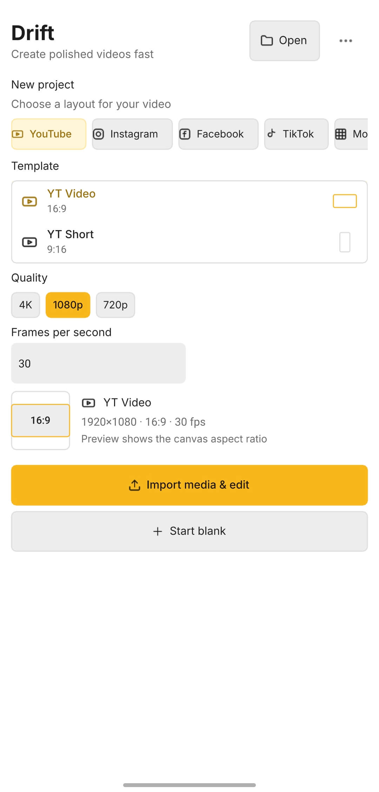
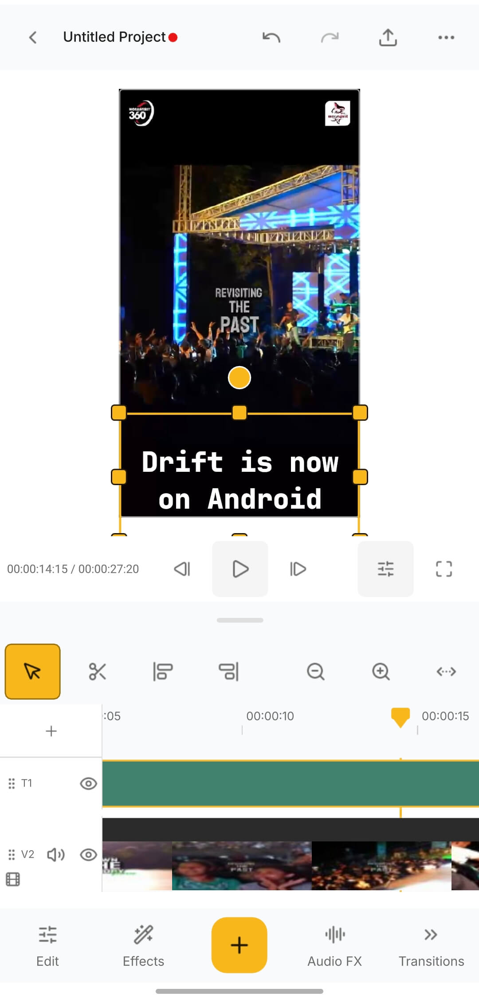
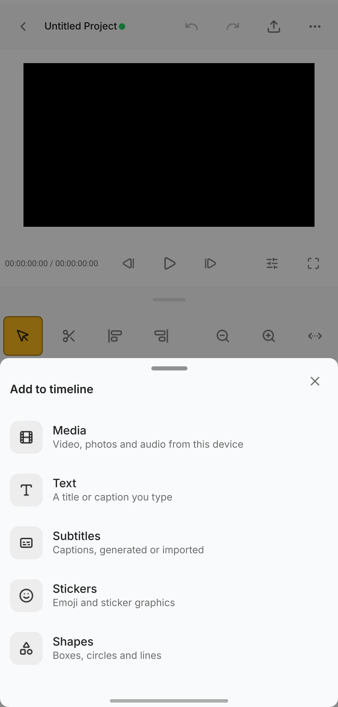
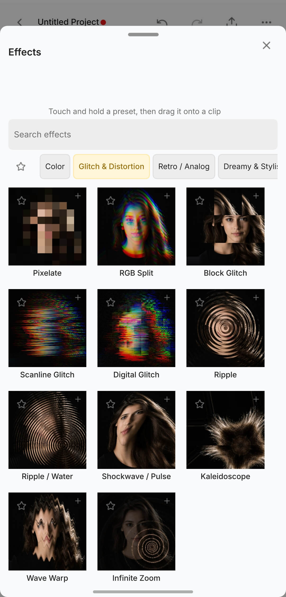
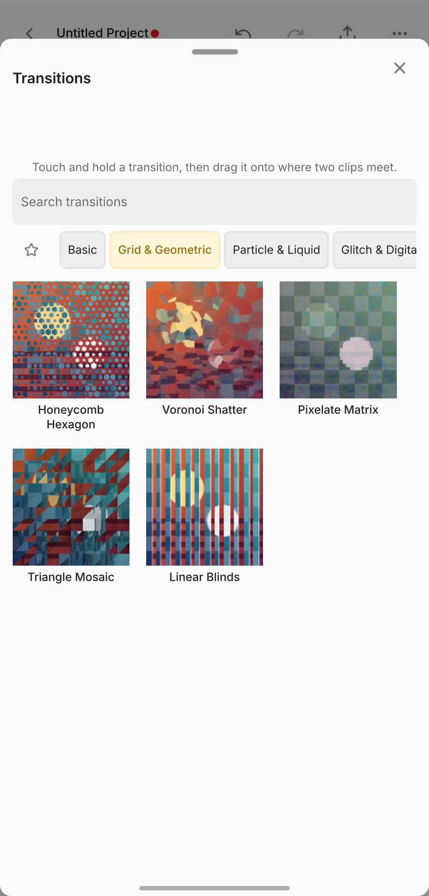

<p align="center">
  
</p>

<h1 align="center">Drift</h1>

<p align="center">
  <strong>Create polished videos fast — free, open, and yours.</strong>
</p>

<p align="center">
  <a href="LICENSE"></a>
  
</p>

<p align="center">
  <a href="https://github.com/CutWire-Studios/Drift-Android">GitHub</a> ·
  <a href="https://github.com/CutWire-Studios/Drift-Android/issues">Issues</a> ·
  <a href="LICENSE">License</a>
</p>

Drift is a free, open-source video editor from CutWire Studios — now on Android. It brings the speed and simplicity of modern creator tools to your phone: drop in clips, add effects and stickers, generate captions, and export — with no subscription, no watermark, and no account required.

This tree is the Android port of [desktop Drift](https://github.com/CutWire-Studios/Drift). Same engine and feature set, mobile-first UI. Built with **Qt 6**, **QML**, and **FFmpeg**. Preview and export share one compositor, so what you see is what you get.

## Download

Release APKs are **coming soon**. Until then, [build from source](#build) and install with the deploy script below.

Track progress on [GitHub](https://github.com/CutWire-Studios/Drift-Android). For the desktop builds (Linux, Windows, macOS), see [CutWire-Studios/Drift](https://github.com/CutWire-Studios/Drift).

## Screenshots

<p align="center">
  
</p>

<p align="center"><em>New project — pick a layout, quality, and FPS, then import media or start blank</em></p>

<p align="center">
  
</p>

<p align="center"><em>Preview, multi-track timeline, and edit / effects / audio / transitions tools</em></p>

<table>
  <tr>
    <td width="33%" align="center">
      <br>
      <strong>Add to timeline</strong> — media, text, captions, stickers, shapes
    </td>
    <td width="33%" align="center">
      <br>
      <strong>Effects</strong> — every preset previewed on a real frame
    </td>
    <td width="33%" align="center">
      <br>
      <strong>Transitions</strong> — drag one where two clips meet
    </td>
  </tr>
</table>

## Features

Feature parity with [desktop Drift](https://github.com/CutWire-Studios/Drift):

- **Multi-track timeline** — trim, split, snap, ripple, mute/hide tracks, and full undo/redo
- **Effects & transitions** — GPU effects, stylish transitions, and reusable look templates
- **Stickers, emoji, titles & shapes** — finish the look without leaving the editor
- **Auto captions** — speech-to-text captions you can edit on the timeline
- **Cutouts & masks** — isolate subjects, mask clips, and key out green screens
- **Speed & motion** — speed changes, reverse, fades, and animate to the beat of your music
- **Audio tools** — mixing, effect chain, and background noise cleanup
- **Addons** — optional fonts, stickers, effects, and speech models on demand
- **Project bundles** — package a project with its media for easy sharing and backup
- **Export** — MP4 (H.264 + AAC) that matches the preview, with quality presets

## Requirements

| Dependency | Notes |
|---|---|
| Host OS | Linux (scripts assume a Linux host) |
| Qt | **6.11.1** Android kit + matching host tools (`android_arm64_v8a` / `android_armv7` / `android_x86_64` + `gcc_64`) |
| Android SDK | `~/Android/Sdk` (or `ANDROID_SDK_ROOT`) |
| NDK | **27.2.12479018** — the version the Qt kit expects; do not mix NDK majors |
| CMake / Ninja | CMake ≥ 3.21, Ninja, host C++ toolchain |
| Java | JDK 17 (for the Android Gradle packaging step) |
| `adb` / `apksigner` | SDK platform-tools + build-tools, for install |

Native libraries are **not** system packages on Android. FFmpeg, x264, zstd, OpenSSL, and SoundTouch are built once per ABI and cached under `third_party/prebuilt/`:

```bash
export ANDROID_NDK_ROOT=~/Android/Sdk/ndk/27.2.12479018
./third_party/build-android.sh arm64-v8a
```

`scripts/build.sh` runs this automatically when the prebuilts are missing.

ONNX Runtime powers auto-subtitles (and related ML features). Drift does not link it — only its headers are needed to build, and the library itself is an addon the user installs from the Acceleration category. Android builds set `-DDRIFT_BUNDLE_ONNXRUNTIME=OFF`; the runtime is never staged into the APK.

**Nothing has to be placed by hand.** Fonts, emoji stickers, and speech models are addons (see below), so a clone builds and runs with no bundled assets.

Optional: OpenCV for experimental background-removal builds (`-DWITH_BGREMOVAL=ON`). Only `core`, `imgproc`, and `imgcodecs` are linked.

## Build

```bash
# Optional overrides:
#   QT_ANDROID_ROOT  QT_HOST_PATH  ANDROID_SDK_ROOT  ANDROID_NDK_ROOT

./scripts/build.sh              # arm64-v8a, RelWithDebInfo
./scripts/build.sh arm64-v8a Release
./scripts/build.sh armeabi-v7a
./scripts/build.sh x86_64
```

The unsigned APK lands under `build/android-<abi>/android-build/`.

Package identity defaults (`org.cutwire.drift`, app name, version code) can be overridden via `DRIFT_ANDROID_PACKAGE_NAME`, `DRIFT_ANDROID_APP_NAME`, and `DRIFT_ANDROID_VERSION_CODE` — CI uses this so debug APKs install alongside a release build.

Min SDK **28**, target SDK **36**.

## Install on a device

```bash
# Signs with the Android debug keystore and adb install -r
./scripts/deploy.sh arm64-v8a
```

If packaging left a stale `android-build/drift.apk`, copy the fresh unsigned release APK there first:

```bash
cp build/android-arm64-v8a/android-build/build/outputs/apk/release/android-build-release-unsigned.apk \
   build/android-arm64-v8a/android-build/drift.apk
./scripts/deploy.sh arm64-v8a
```

## Device self-test

Compositor smoke test on a connected device (no UI): push a project + media, composite one frame, pull `selftest.png`:

```bash
./scripts/selftest.sh project.dcut.json clip.mp4
```

Compare against a desktop `renderframe` of the same project when you have a host build available.

## Addons

Fonts, emoji stickers, and speech models download at runtime rather than shipping in the APK. That keeps the install small and lets you take only what you need. Open the Addon Manager from the header, or follow the install prompt in the font picker, stickers tab, or auto-subtitle panel.

Packages are `.driftpkg` archives — zstd-compressed, Ed25519-signed, and verified before install — under the app’s addons directory. Format, registry, and installer live in `src/engine/AddonPackage.*`, `src/engine/AddonRegistry.*`, and `src/models/AddonManager.*`.

**Effects and transitions are bundled *and* addons.** They ship inside the APK so the editor works out of the box; `effects.core` / `transitions.core` addons can ship shader fixes without an app release. Content resolves highest-priority-first:

```
1. $DRIFT_*_DIR          developer override (host / debug)
2. installed addon       downloaded updates
3. bundled with the APK  effects, transitions, templates, audio-effects
4. app data location     hand-placed
```

Catalogs resolve duplicate ids first-root-wins, so an installed `builtin.effects.gaussian_blur` supersedes the bundled one. An addon cannot *remove* a bundled package — the bundled copy reappears when the addon no longer defines that id.

Opening a project that uses an effect or transition with no catalog entry reports it rather than silently dropping it from the render.

### Pointing at a different service

The endpoint and client token are defined in `CMakeLists.txt` and injected as compile definitions — `src/models/AddonEndpoint.h` only reads them.

```bash
# Pass through qt-cmake / scripts/build.sh environment as needed:
cmake … -DDRIFT_ADDON_INDEX_URL=https://addons.example.com/v1/index \
        -DDRIFT_ADDON_CLIENT_TOKEN=your-token

cmake … -DDRIFT_ADDON_INDEX_URL=      # build with no addon service at all
```

With the service disabled the manager lists and installs nothing; already-installed, side-loaded, and override-dir content still work.

The token is not a secret — it ships in every binary. It exists so the bucket cannot be crawled or hotlinked.

These are CMake *cache* variables: changing the default in `CMakeLists.txt` does not affect an existing build directory, so pass `-D...` again or reconfigure from scratch.

Building and publishing addons lives in a separate repository, along with the Cloudflare Worker that serves them.

## Project layout

```
src/
  core/           Domain model (Project, Track, Clip, Keyframe, Effect) — no GUI
  engine/         FFmpeg: ClipReader, FrameCompositor, AudioMixer, EffectProcessor, Exporter
  models/         QML-facing models: AppController, AssetLibrary, TimelineModel, ClipListModel
  playback/       PlaybackEngine, PlaybackClock, CompositorService
  preview/        PreviewItem (QQuickItem → QSGTexture)
  qml/            UI panels and components (mobile layout)
android/          Android package overlay (manifest, splash, icons)
scripts/          build.sh, deploy.sh, selftest.sh, icon helpers
third_party/      Android dependency build script (sources & prebuilts are gitignored)
effects/, transitions/, effect-templates/, audio-effects/
                  Bundled effect packs (also available as addons)
tests/            Unit tests (desktop / host builds — not part of the APK)
tools/            Headless probe + renderframe (host builds)
.github/          Android CI workflow
cmake/            Find modules and Android helpers
```

## Releasing

Release APKs are not published yet — coming soon. The [Android](.github/workflows/android.yml) workflow already builds `arm64-v8a`, `armeabi-v7a`, and `x86_64` on every push.

When tagging a release, bump `project(Drift VERSION ...)` in `CMakeLists.txt` and set `DRIFT_ANDROID_VERSION_CODE` so the store / sideload install path can upgrade cleanly.

## Architecture (summary)

**Unified frame server** — Preview and export share `FrameCompositor`:

> “Give me the composited RGBA frame + mixed audio at timeline time T (µs).”

**Time model** — Core timeline positions are `int64_t` microseconds (`drift::TimeUs`). QML uses seconds at the boundary via `AppController`.

**Threading**

| Thread | Responsibility |
|---|---|
| Main (GUI) | QML, models, undo stack, playhead UI |
| Decode workers | `ClipReaderPool` — one thread per active media path |
| Compositor | `CompositorService` — frames off the GUI thread |
| Audio (pull) | Android audio output → `PlaybackClock` (audio-master) |

**Data flow (video)**

```
Media file → ClipReader → EffectProcessor
          → FrameCompositor (transforms, blending, text, masks)
          → PreviewItem (QSGTexture)  |  Exporter
```

**Data flow (audio)**

```
Media file → ClipReader → AudioMixer (volume, fades, audio effects)
          → audio output  |  Exporter
```

## QML entry points

Singletons registered in `main.cpp`:

- `EditorState` / `AppController` — timeline controller
- `AssetLibrary` — media bin

## License

GPLv3 — see [LICENSE](LICENSE).
